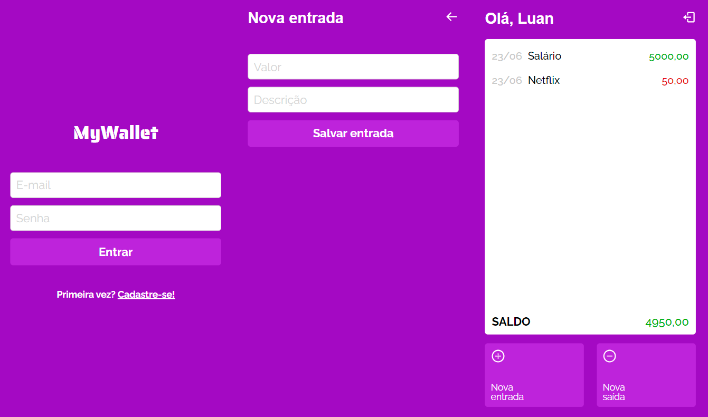

# MyWallet
# App para registro de fluxo financeiro
## Tecnologias Utilizadas no front-end:
|HTML|CSS|JavaScript|ReactJS|
|-|-|-|-|
|||||
|Sintaxe JSX|Utilizado na estilização das páginas e dos componentes com styled components|Aplicação das funcionalidades com o Framework React|Recursos Utilizados: Function Components, React Router DOM, React Hooks|
___
## Tecnologias Utilizadas no back-end:
|JavaScript|Node.js|Express.js|Postgres|
|-|-|-|-|
|||||
|Linguagem utilizada|Criação do servidor e da API para comunicação com o banco de dados|Biblioteca para facilitar a criação da API no node.js|Banco de dados relacional utilizado|
___
[Clique aqui](https://mywallet-nu.vercel.app/) para acessar o App
___

